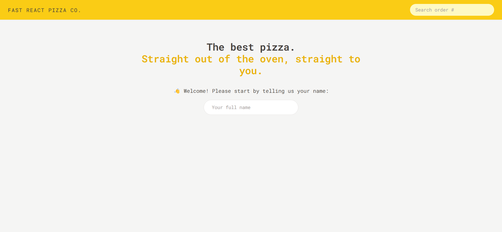
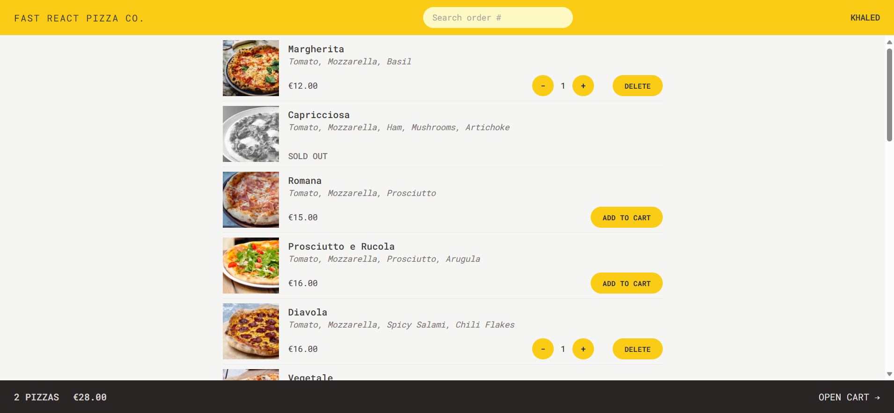
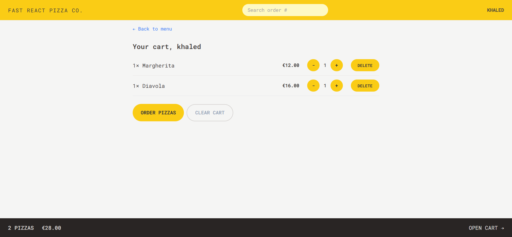
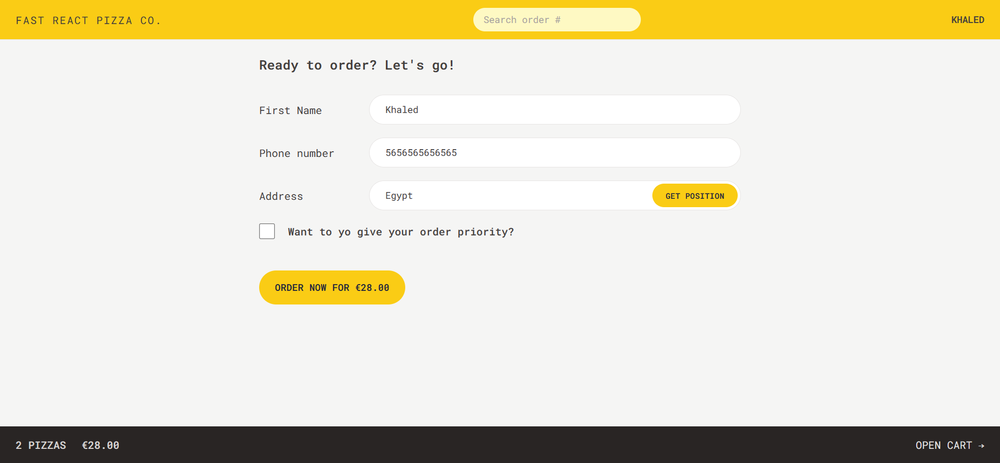
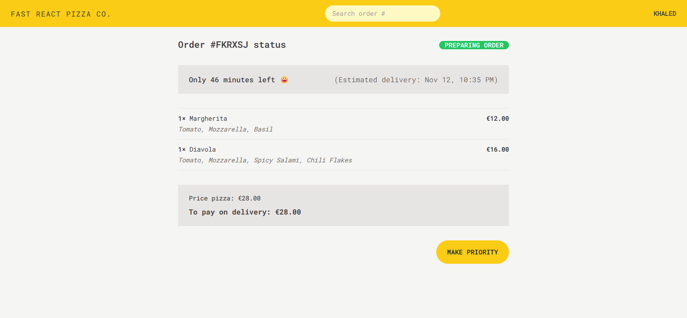

<h1 align="center">🍕 Fast React Pizza Co.</h1>

## Table of Contents

- [Table of Contents](#table-of-contents)
- [👋Introduction](#introduction)
- [🌟Features](#features)
- [🚀 Live Demo](#-live-demo)
- [📸 Screenshots](#-screenshots)
  - [🏠 Home Page](#-home-page)
  - [🍽️ Menu page](#️-menu-page)
  - [🛒 Cart Page](#-cart-page)
  - [🛍️ Create Order Page](#️-create-order-page)
  - [📋 Order Summary Page](#-order-summary-page)
- [🛠️Technologies Used](#️technologies-used)
- [🏁Getting Started](#getting-started)
- [⬇️Installation](#️installation)
- [🔧Usage](#usage)
- [📄License](#license)

## 👋Introduction

pizza ordering application that allows users to easily select and order pizzas from a dynamic menu. The app focuses on simplicity, eliminating the need for user accounts and login. Users input their names before using the app, and the menu is loaded from an API, enabling menu updates.

## 🌟Features

- Enter your name
- Select a pizza from the menu
- See your cart
- Order your pizza
- use your location to get your order
- prioritize your order
- search for your order

## 🚀 Live Demo

[fast-react-pizza](https://fast-react-pizza-ts.netlify.app)

## 📸 Screenshots

### 🏠 Home Page



### 🍽️ Menu page



### 🛒 Cart Page



### 🛍️ Create Order Page



### 📋 Order Summary Page



## 🛠️Technologies Used

The fast-react-pizza project utilizes the following technologies:

-  &nbsp; &nbsp;[React](https://reactjs.org/)

-  &nbsp; &nbsp;[React Router](https://reactrouter.com/)

-  &nbsp; &nbsp; [Redux](https://redux.js.org/)

-  &nbsp; &nbsp;[Tailwind](https://tailwindcss.com/)

-  &nbsp; &nbsp;[TypeScript](https://www.typescriptlang.org/)

## 🏁Getting Started

To set up the fast-react-pizza project locally, follow the instructions below.

## ⬇️Installation

1. Clone the repository:

   ```bash
   git clone https://github.com/khaled-farahat/fast-react-pizza.git
   cd fast-react-pizza
   ```

1. Install the dependencies:

   ```bash
   npm install
   ```

## 🔧Usage

1. Run the development server:

   ```bash
   npm run dev
   ```

1. Open your browser and navigate to [http://localhost:5173/](http://localhost:5173/) to access fast-react-pizza application.

## 📄License

The fast-react-pizza project is open-source and is licensed under the [MIT License](LICENSE) .
